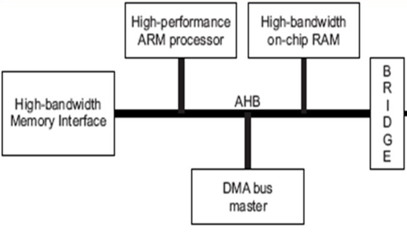
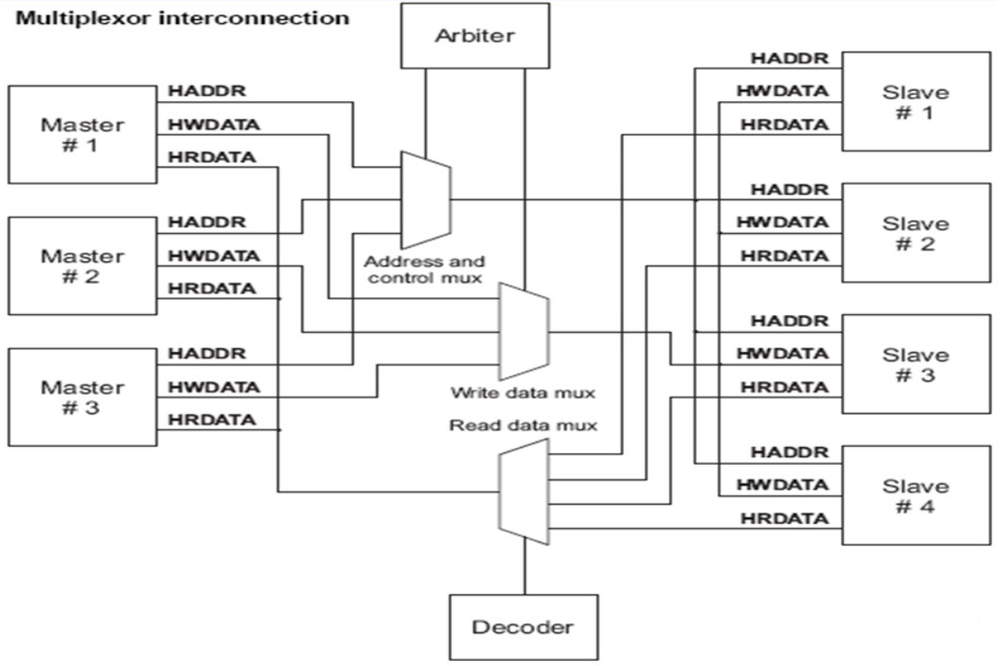
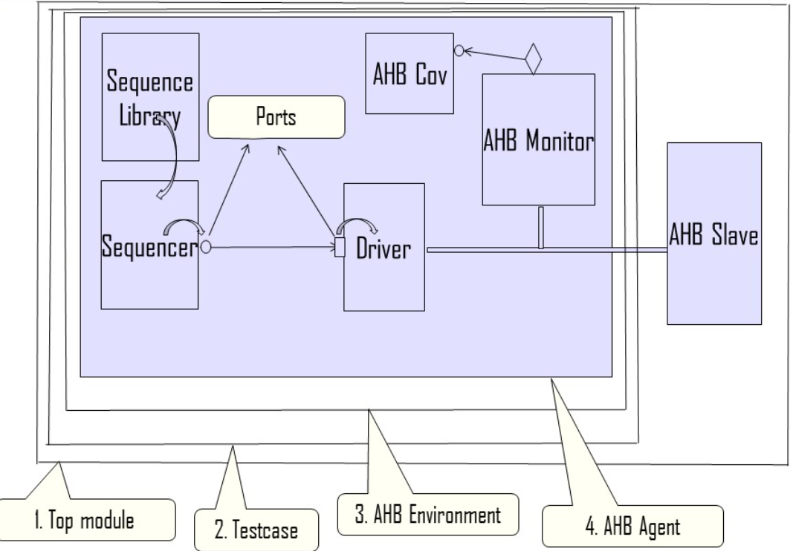

# AHB_UVC_DEVELOPMENT
## Description
This repository hosts a comprehensive UVM-based ***UVC (Universal Verification Component)*** for validating an AHB5 (Advanced High-performance Bus 5).

The AHB5 protocol is a critical part of modern System-on-Chip (SoC) designs, providing high-performance and low-latency communication between different IP blocks. This project aims to verify the functionality and performance of an AHB5 interface using the Universal Verification Methodology (UVM), a widely adopted framework for verification in the semiconductor industry.

**EDA Playground link :** [AHB_UVC_TEMPLATE](https://www.edaplayground.com/x/jKZu)

## AHB UVC 
  
  
  
*AHB Block Diagram*
 
  
-The AHB5 Interconnect is a crucial component in modern System-on-Chip (SoC) designs, facilitating seamless communication among different on-chip modules and intellectual property (IP) blocks.

-It ensures high-speed and low-latency data transfer between various components, contributing to optimal performance and reduced data transfer latencies.

-The interconnect employs a sophisticated arbitration mechanism to manage competing requests from multiple initiators, ensuring fair access to shared resources and preventing data bottlenecks.

-It supports a wide range of transaction types, including read, write, burst, and non-sequential transfers, catering to the diverse communication needs of different IP blocks.
-The AHB5 Interconnect is designed to accommodate multiple bus widths, burst transfers, and out-of-order responses, enhancing overall system efficiency.

-Thorough verification methodologies are essential to ensure the correct operation of the AHB5 Interconnect, involving rigorous testing of data transfer capabilities, arbitration mechanisms, and protocol compliance.
 
   

*AHB Interconnect Diagram* 

 

*AHB UVC Diagram* 

  
### Features
- Complete UVM-based testbench for AHB5 interface verification.
- Comprehensive test scenarios covering various corner cases and use cases.
- Assertion-based verification to ensure protocol compliance.

### Prerequisites
- SystemVerilog knowledge.
- Understanding of UVM concepts and methodologies.
- ModelSim or other compatible simulation tool.

### Directory Specifications:

- [Common](Common) : This directory houses essential files that are shared and utilized across the entire testbench.
- [Environment](Environment) : Contains the files for UVC implementation
- [Test_Top](Test_Top) : Within this directory, you'll find UVM test files, with a collection of testcases each serving a specific purpose in thoroughly testing the AHB_UVC implementation.
- [Images](Images) : Contains the images used in this readme file.

  TODO: Update ReadMe
